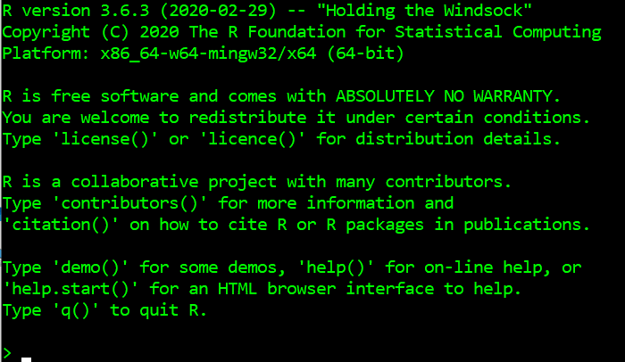

```{r setup, include=FALSE}
library(learnr)
knitr::opts_chunk$set(echo = FALSE)
tutorial_options(
  exercise.cap = "Kode",
  exercise.startover = FALSE,
  exercise.lines = 5
)
```

## 

{width=800px}

## Hva er dette for noe?

Dette er en kursmodul og interaktiv øvelsessamling for kurset Bibliometri for latsabber. Læringsmateriale vil bli sendt ut noen dager før hver kursmodul, og det kan være lurt å lese det som står her, prøve seg på oppgavene og se om det er noe du ønsker å ta opp under selve kurset.

Disse dokumentene inneholder en introduksjon til konseptene vi skal ta for oss hver uke, og vil ofte være ledsaget av en kviss eller noen oppgaver hvor du selv kan prøve å skrive enkel kode som svarer til temaet du nettopp har gått gjennom.


### Bibliometri? Latsabber?

Dette kurset er ganske allment innrettet, men det er i utgangspunktet et tilbud til folk som jobber med å innhente og analysere informasjon om norske utdannings- og forskningsinstitusjoners publiseringsaktivitet. Fagområdet som tar for seg hvordan man skal tolke publiseringsdata har det feiende flotte navnet bibliometri.

Navnet på kurset er likevel temmelig misvisende: det handler hovedsakelig om programmatisk behandling av data, ikke om bibliometriske prinsipper og metoder. Likevel er det ikke til å komme unna at for å kunne si noe vettugt om publiseringsdata må man være i stand til å behandle disse.

Heldigvis er det sånn at publiseringsdata ofte kommer i formater som egner seg svært godt til programmatisk analyse uten å bruke alt for mye energi på å rydde og tilpasse data. Det er her latsabb-biten kommer inn. Meningen med å lære seg grunnleggende databehandling i R er å kunne behandle store mengder data på en effektiv, systematisk og reproduserbar måte. Å investere litt arbeid i å lære seg å programmere, om så bare for å kunne kjøre andres skript, vil raskt kaste av seg i form av innspart tid eller bedre analyser.


### Men...hvorfor kan jeg ikke bare se noen videoer?

> Av alle lidenskapar er latskapen den sterkaste, ja, 
> ingen lidenskap er sterkare enn lidenskapen latskap, 
> det er i latskapen sinnet er mest kjenslevart. 
>
> [--- Samuel Beckett, **Ord og tonar**]{style="float:right"}

Sagt på en annen måte: kursansvarlig er også lat, og noen ting må også du gjøre...


## Hvorfor dette kurset?

> "You can't do data science in a GUI"
>
> [--- Hadley Wickham]{style="float:right"}

Mange som jobber i administrative stillinger i universitets- og høyskolesektoren opplever at de i økende grad blir bedt om skaffe til veie data om sin og andres virksomhet, og det er generelt et økt fokus på statistikk og informasjon om ting som publisering, sitering, samarbeid på tvers av institusjoner og landegrenser, resultater av deltakelse i forskningsprosjekter og lignende oversikter.

Slike data blir i stor grad behandlet på temmelig manuelt vis, med stort innslag av repetetivt og tungvint arbeid som må gjøres om igjen for hvert regneark vi mottar på e-post og lagrer i en mappe på vår egen maskin. Et håp for dette kurset er at flere som jobber med publiseringsdata i Norge kan bli interessert i å jobbe etter et felles sett prinsipper for god datahåndtering og -analyse, og at vi alle skal utvikle kompetanse på hvordan vi kan utvikle løsninger som kommer alle til gode - om vi snakker samme (programmerings)språk kan vi også dele metoder, kode og arbeid som blir gjort og spare mye dobbel- og trippelarbeid.

Og så er det sabla gøy, da.


### Målene med kurset

Dette kurset kommer ikke til å gjøre deg til programmerer. Målet er å gjøre deg i stand til å gjenkjenne de viktigste delene av et stykke kode, og gi deg akkurat nok kunnskap til å kunne begynne å snoke rundt etter løsninger selv når du støter på de uunngåelige problemene du kommer opp i når du skal få en svært rask og stokk dum maskin til å gjøre arbeid for deg.

I tillegg skal vi ta for oss noen gode prinsipper for hvordan jobbe med data, og dette vil kunne komme godt med når du skal bruke andres arbeid og kanskje på sikt bidra selv.

Læringsmål er populært i utdanningssektoren, og her de konkrete for dette kurset. Når du har gått gjennom modulene og oppgavene skal du kunne:

- kjenne til objekter, funksjoner og de viktigste dataklassene
- bruke de viktigste funksjonene i `tidyverse`-dialekten av R
- åpne et skript og kjøre operasjonene bit for bit
- lese inn data, gjøre noe med dem, og lagre resultatet

I tillegg vil du bli introdusert til hvordan å tenke strukturert om grafisk fremstilling av data, og hvordan dette foregår i R. Her er det en liten læringskurve, så det er slett ikke sikkert det oppleves som enklere enn måter du er vant til å gjøre det, men om du gjennom dette kurset blir ansporet til å aldri lage kakediagrammer i 3D eller lage Excel-ark med mange separate tabeller i samme ark igjen kan jeg dø en lykkelig mann.


```{r kviss_1}
quiz(
  question_checkbox(
    text = "Hva er målet med dette kurset?",
    answer(
      text = "Slå i hjel tid i vente på pensjonisttilværelsen",
      message = "Feil, det er middelet, ikke målet..."
      ),
    answer(
      text = "Kunne bruke andres kode og kanskje forstå litt av den også", 
      correct = TRUE,
      message = "Dæven døtte."
      ),
    answer(
      text = "Lære å programmere",
      message = "Hadde det enda vært så vel..."
      ),
    allow_retry = TRUE,
    submit_button = "Prøv lykken",
    correct = "Riktig!",
    incorrect = "Tsk tsk tsk..."
  ),
  caption = "Kviss"
)
```


## Struktur på kurset

Bibliometri for latsabber er organisert i seks moduler:

### Modul 1: R og RStudio

I denne første modulen vil du få en innføring i R og det mest brukte utviklermiljøet for språket, RStudio. Vi skal lære om funksjoner, objekter og hvordan data er organisert i R. Dette er de viktigste konseptene for å kunne starte å jobbe i R, og når du skjønner hvordan disse fungerer vil du raskt oppdage hvor mye mer du kan gjøre fortere enn du var vant til fra før.


### Modul 2: Ryddige data

R er designet for å jobbe med data, og kjernen av språket er bygget rundt manipulasjon av strukturerte data. Blant annet er data i tabellform en egen dataklasse bygget inn i R, noe som er unikt for dette språket.

I denne modulen skal vi lære hvordan vi kan gjøre det meste ut av måten R behandler data på, og et sett gode vaner for å strukturere og behandle data på. Ideen om ryddige ("tidy") data ligger til grunn for den dialekten av R vi skal lære, `tidyverse`, og er en enkel og god modell for data som er nyttig å tenke med enten du jobber med databaser i SQL, `pandas` i Python eller Excel-dokumenter.


### Modul 3: Jobbe med datasett

I tredje modul skal vi begynne å ta i bruk tidy-teorien vi lærte i modul 2. Målet er å kunne importere data i flere formater, utføre noen vanlige ryddeoppgaver som ofte må gjøres før vi kan begynne å analysere data, og gjøre oppsummerende beregninger av innholdet i tidvis store datasett. Fra og med nå vil du forhåpentligvis forstå kraften som ligger i programmatisk databehandling... 


### Modul 4: Data fra flere kilder

Ofte ønsker vi å kunne sammenstille og sammenligne data fra flere kilder. I denne modulen skal vi se på nyttige funksjoner for å slå sammen datasett basert på felles id-nøkler, og hvordan vi kan berike for eksempel Cristin-data med andre interessante tall, som COUNTER-statistikk eller siteringstall.


### Modul 5: Visualisering

Jo større datamengder, jo vanskeligere å ta inn over seg og forstå hva som ligger i dem. Siden bilder sier mer enn tusen ord er det svært nyttig å kunne lage gode grafiske fremstillinger av data, både for at du selv skal forstå mer av hva som fins i dataene, og for at du skal kunne kommunisere dette godt med andre som er interessert i informasjonen men ikke har tid til å grave seg ned i kolonnene i regnearket ditt.

I denne modulen skal vi lære prinsippene som ligger til grunn for R sin implementering av konseptet grafisk grammatikk, og lære hvordan vi raskt kan lage gode, programmatisk genererte (og dermed enkelt reproduserbare) grafer som framstiller tidvis store mengder data på en lettfattelig måte.


### Modul 6: Tenke om, skrive om og presentere kode

I siste modul skal vi se på hvordan vi kan gjøre arbeidet vårt systematisk og reproduserbart - det vil spare oss for mye merarbeid, og er gode vaner å ha med seg uansett hva vi jobber med. Vi skal se på prosjektformatet i RStudio, og også lære om rapportering og bruk av RMarkdown til å sy sammen alle de tingene vi har lært tidligere i kurset.


## RStudio

R er ikke et program du kan kjøre av deg selv. Koden må tolkes og oversettes til kommandoer maskina forstår. Det *kan* gjøres direkte i terminalen til maskina, men den løsningen mangler alt av funksjonalitet som gjør ting nyttig for oss, for ikke å snakke om at det ser temmelig ulekkert ut:



I stedet bruker vi et såkalt integrert utviklermiljø (IDE) som heter RStudio. RStudio er tekstredigering, kodemaskin, visualisering og prosjektorganisator i ett.

Vi skal komme tilbake til alle herlighetene som er tilgjengelig i RStudio, men for nå holder det å vite at RStudio hjelper oss å holde styr på hva vi har gjort, hvor vi har filene våre, hvilke pakker vi har installert og hvilke som må oppdateres og kort sagt alt vi trenger for å ha bittesmå og kjempestore prosjekter gående.

Vi skal bruke litt tid på å se på hvordan RStudio fungerer på kurset, men en nyttig innføring finner du i et [eget kapittel](https://b-rodrigues.github.io/modern_R/getting-to-know-rstudio.html) i Bruno Rodrigues sin innføringsbok i R, *Modern R with the tidyverse*.


## Men hva er egentlig R?

Du har kanskje en ørliten anelse om hva R er for noe allerede: Du har funnet veien til dette kurset, og du har også klart å skrive inn kommandoen som starter opp kurset. Okke som, her er en kort oppsummering: R er et programmeringsspråk spesielt utviklet for arbeid med data, og særlig statistiske analyser av disse. Det kan brukes til alt andre programmeringsspråk brukes til (for eksempel å lage interaktive øvelsessamlinger), men er optimalisert for typiske dataanalyseoppgaver - det fins både raskere og mer fleksible språk for mer generelle informatikkformål.

Noe av det vanskeligste med å lære seg programmering er å lære seg en litt ny måte å tenke på. R er et svært begynnervennlig språk, men det er noen konsepter som det kan ta litt tid å venne seg til. Det viktigste er at R-kode, som all annen programkode, i bunn og grunn er ren tekst. Det betyr at du må beskrive alt du vil gjøre i form av skrevne kommandoer, og til det trenger du det samme som alle "vanlige" språk har: substantiv og verb. I tillegg må vi kunne vite forskjellen på substantivene våre. I R, som i mange andre programmeringsspråk, heter disse tingene objekter, funksjoner og klasser. Og alt, absolutt alt, har et navn.

```{r kviss_3}
quiz(
  question_checkbox(
    text = "Hva er R?",
    answer(
      text = "En forløper til S",
      message = "Tvert om, programmeringsspråket S er faktisk forløperen til R. Informatikere har dårlig fantasi..."
      ),
    answer(
      text = "En lyd pirater lager",
      message = "Sorry, det der stammer fra disneyfilmen Treasure Island (1950)"
      ),
    answer(
      text = "Et programmeringsspråk for statistisk analyse",
      correct = TRUE,
      message = "Hei, du kan i hvert fall lese..."
      ),
    allow_retry = TRUE,
    submit_button = "Prøv lykken",
    correct = "Riktig!",
    incorrect = "Tsk tsk tsk..."
  ),
  caption = "Kviss"
)
```

Her er fire nyttige ting å vite om R:

### Alt har et navn
Alt i R har et navn, enten de er variabler (som `mitt_tall`), funksjoner (som `gjør_dette()`) eller datasett (som `cristin_data_2020`). Det fins noen forbudte navn, og det er viktig å huske på at navn må skrives helt nøyaktig for at R skal forstå hva du snakker om, men ellers er det fritt fram til å gi ting det navnet du vil.


### Alt er et objekt
Koden vi skriver jobber med objekter. Noen kommer med funksjonene vi bruker, men de fleste lager vi selv. Objekter er substantivene i språket vårt. Vi kan lage objekter ut av løse lufta - dette lager en tekststreng:

```{r}
"Henrik"
```

...men som regel vil vi at R skal huske hva de er for noe. Da må de tildeles et navn, og det gjør vi med `<-`:

```{r, echo = TRUE}
kursholder <- "Henrik"
```

Fra nå av vet R at `kursholder` er "Henrik", men dette er selvfølgelig ikke skrevet i stein. La oss se om vi kan nominere noen andre til denne jobben:

*ØVELSE - Gjør noen andre til kursholder*:

```{r inst_navn, exercise = TRUE, exercise.eval = TRUE}

```

```{r inst_navn-hint}
kursholder <- "Anne"
```

Det var vel ikke så vanskelig? Om du lurer på hvilke objekter du har laget og hva de inneholder kan du alltid finne dem i "Environment"-fanen i RStudio. Den inneholder også info om størrelsen på objektet og andre nyttige ting.


### Du gjør ting med funksjoner
Det er fint med en samling ting, men det er enda finere å kunne gjøre noe med dem. Til de har vi *funksjoner*. De er verbene i R, og alle fungerer på samme måte: du mater noe inn, og den spytter noe ut igjen. En funksjon er også et objekt, som alt annet i R, men de har en spesiell form - i tillegg til et navn kommer de med en parentes til slutt:

```{r, echo = TRUE, eval = FALSE}
min_funksjon()
```

De færresten funksjoner gjør noe uten å få matet inn noe å gjøre noe *med*. Innmatingen er det parentesen er til for. La oss si vi vil telle hvor mange bokstaver kursholderen har i navnet sitt. Til det bruker vi `nchar()`-funksjonen. Den tar inn en tekststreng og sender tilbake antall tegn i strengen.

```{r, echo = TRUE}
nchar(x = kursholder)
```

Men vent, hva er den *x*-en der? En funksjon kan gjøre forskjellige ting alt etter hva den får matet inn, og noen av dem kan ha veldig finkornete operasjoner basert på mange kontrollene. Disse kontrollene kalles argumenter, og vi styrer hva funksjonene skal gjøre for oss med argumentene. I tilfellet `nchar()` er *x* tekststrengen den skal telle for oss. Om du lurer på hvilke argumenter som kan mates til en funksjon kan du slå opp i dokumentasjonen til funksjonen ved å sette et spørsmålstegn foran funksjonsnavnet: 

```{r, echo = TRUE, eval = FALSE}
?nchar
```


Dette gjelder selvfølgelig bare der den som skrev funksjonen har laget slik dokumentasjon...


#### ØVELSE

Blant de viktigste funksjonene i R er den som lar deg definere en samling elementer av samme type, `c()`. Du gir den de tingene du vil sammenstille, og så vet R at den kan utføre operasjoner på denne samlingen (en slik samling heter for øvrig en vektor...).

Eksempel:

```{r, echo = TRUE}
mine_tall <- c(1.5, 2.8, 3.3)
```

Hvis jeg vil se på hva som er i denne vektoren trenger jeg bare skrive navnet:

```{r, echo = TRUE}
mine_tall
```


Prøv selv!

*Lag en vektor med tre tall og se på den etterpå:*

```{r vectors, exercise = TRUE, exercise.eval = TRUE}

```

```{r vectors-hint}
nye_tall <- c(1.5, 2.8, 3.3)
nye_tall
```

Når vi har gjort dette kan vi prøve oss på å beregne gjennomsnittet av tallene våre, med `mean()`-funksjonen. Den trenger en vektor med tall å regne på for å gjøre noe.

```{r vec_mean, exercise = TRUE, exercise.eval = TRUE}

```

```{r vec_mean-hint}
nyere_tall <- c(1, 2, 3)
mean(nyere_tall)
```


### Funksjoner kommer i pakker

Funksjoner er noe du kan lage selv (og det skal vi lære), men som oftest vil du bruke funksjoner laget av andre - som en god latsabb.

Du får tak i andres funksjoner ved å laste ned og ta i bruk pakker av funksjoner. Det har du allerede gjort da du installerte `tidyverse` og `usethis`-pakkene (ved å bruke `install.packages()`-funksjonen):

```{r, echo = TRUE, eval = FALSE}
install.packages("tidyverse")
install.packages("usethis")
```

Pakker kommer enten fra R sitt sentrale pakkelager, [CRAN](https://cran.r-project.org/), eller fra andre kodelagre, typisk GitHub. Dette kurset kommer i form av en [pakke fra GitHub](https://github.com/henrikkarlstrom/latsabber).

Når du skal bruke funksjoner fra pakker du har installert må du huske å fortelle R at du har tenkt til å bruke akkurat disse funksjonene, ved å laste dem inn. Det gjør du med `library()`-funksjonen. Dette vil du for eksempel putte øverst på de fleste skriptene dine når du jobber med data:

```{r, echo = TRUE, eval = FALSE}
library(tidyverse)
```


### Klasser

Objektene i R kommer i flere former. Faktisk har vi allerede snakket om flere av disse - jeg har vist fram en tekststreng (`kursholder`), en vektor (`mine_tall`) og flere funksjoner (som `nchar()` og `mean()`) - som oppfører seg litt forskjellig. Disse er eksempler på forskjellige klasser.

En tekststreng har klassen "character", en funksjon har klassen "function" (selvfølgelig). Det er mange andre klassen, og vi skal ikke gå inn på dem alle her, men det er greit å vite at det går an å gjøre forskjellige ting med forskjellige klassen. Klassene "integer" og "double" er for eksempel typer tall, som man kan gjøre regneoperasjoner med, mens vektorer ("vector"), lister ("list") og tabeller ("tibble") er typer datastrukturer som ordner data på forskjellige måter og muligggjør forskjellige operasjoner.

```{r kviss_2}
quiz(
  question_checkbox(
    text = "Hva er sant om klasser?",
    answer(
      text = "De betegner forskjellige typer objekter i R, og hva man kan gjøre med dem",
      correct = TRUE,
      message = "Ikke verst!"
      ),
    answer(
      text = "De er samlinger av individer som deler felles økonomiske interesser, har en felles bevissthet om dette forholdet og deltar i kollektiv handling som fremmer disse interessene",
      message = "Feil sammenheng, kamerat"
      ),
    allow_retry = TRUE,
    submit_button = "Prøv lykken",
    correct = "Riktig!",
    incorrect = "Tsk tsk tsk..."
  ),
  caption = "Kviss"
)
```

## Ferdig!

Dett var dett for denne gang. Nye spennende eventyr venter i neste oppgavesamling...