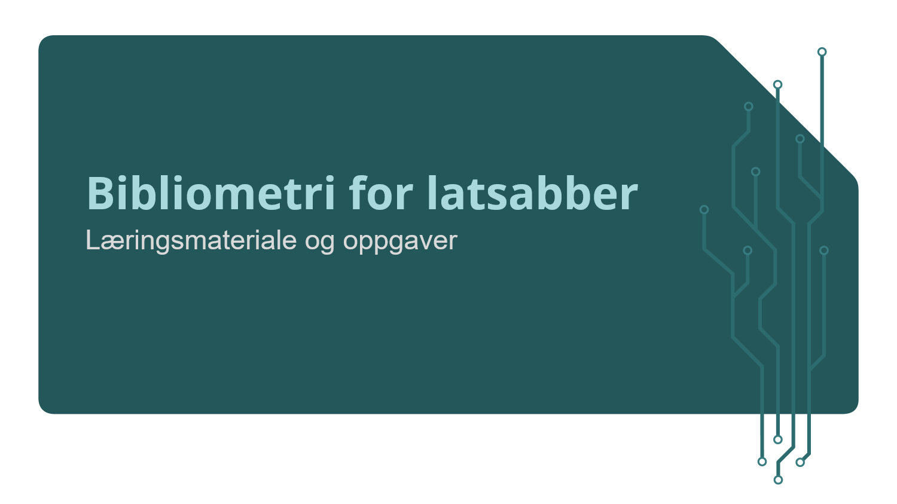

```{r setup, include=FALSE}
library(learnr)
knitr::opts_chunk$set(echo = FALSE)
tutorial_options(
  exercise.cap = "Kode",
  exercise.startover = FALSE,
  exercise.lines = 5
)
```

## 

{width=800px}

## Hva er dette for noe?

Dette er en kursmodul og interaktiv øvelsessamling for kurset Bibliometri for latsabber. Læringsmateriale vil bli sendt ut noen dager før hver kursmodul, og det kan være lurt å lese det som står her, prøve seg på oppgavene og se om det er noe du ønsker å ta opp under selve kurset.

Disse dokumentene inneholder en introduksjon til konseptene vi skal ta for oss hver uke, og vil ofte være ledsaget av en kviss eller noen oppgaver hvor du selv kan prøve å skrive enkel kode som svarer til temaet vi nettopp har gått gjennom.


### Bibliometri? Latsabber?

Dette kurset er ganske allment innrettet, men det er i utgangspunktet et tilbud til folk som jobber med å innhente og analysere informasjon om norske utdannings- og forskningsinstitusjoners publiseringsaktivitet. Fagområdet som tar for seg hvordan man skal tolke publiseringsdata har det feiende flotte navnet bibliometri.

Navnet på kurset er likevel temmelig misvisende: det handler hovedsakelig om programmatisk behandling av data, ikke om bibliometriske prinsipper og metoder. Likevel er det ikke til å komme unna at for å kunne si noe vettugt om publiseringsdata må man være i stand til å behandle disse dataene.

Heldigvis er det sånn at publiseringsdata ofte kommer i formater som egner seg svært godt til programmatisk analyse uten å bruke alt for mye energi på å rydde og tilpasse data. Det er her latsabb-biten kommer inn. Meningen med å lære seg grunnleggende databehandling i R er å kunne behandle store mengder data på en effektiv, systematisk og reproduserbar måte. Å investere litt arbeid i å lære seg å programmere, om så bare for å kunne kjøre andres skript, vil raskt kaste av seg i form av innspart tid eller bedre analyser.


### Men...hvorfor kan jeg ikke bare se noen videoer?

> Av alle lidenskapar er latskapen den sterkaste, ja, 
> ingen lidenskap er sterkare enn lidenskapen latskap, 
> det er i latskapen sinnet er mest kjenslevart. 
>
> [--- Samuel Beckett, **Ord og tonar**]{style="float:right"}

<br>
<br>
Sagt på en annen måte: kursansvarlig er også lat, og noen ting må også du gjøre...


## Hvorfor dette kurset?

> "You can't do data science in a GUI"
>
> [--- Hadley Wickham]{style="float:right"}

Mange som jobber i administrative stillinger i universitets- og høyskolesektoren opplever at de i økende grad blir bedt om skaffe til veie data om virksomhetene sine, og det er generelt et økt fokus på statistikk og informasjon om ting som publisering, sitering, samarbeid på tvers av institusjoner og landegrenser, resultater av deltakelse i forskningsprosjekter og lignende oversikter.

Å kunne svare på forespørsler om disse tingene 


### Målene med kurset

Dette kurset kommer ikke til å gjøre deg til programmerer. Målet er å gjøre deg i stand til å gjenkjenne de viktigste delene av et stykke kode, og gi deg akkurat nok kunnskap til å kunne begynne å snoke rundt etter løsninger selv når du støter på de uunngåelige problemene du kommer opp i når du skal få en svært rask og stokk dum maskin til å gjøre arbeid for deg.

I tillegg skal vi ta for oss noen gode prinsipper for hvordan jobbe med data, og dette vil kunne komme godt med når du skal bruke andres arbeid og kanskje på sikt bidra selv.

Læringsmål er populært i utdanningssektoren, og her de konkrete for dette kurset. Når du har gått gjennom modulene og oppgavene skal du kunne:

- kjenne til objekter, funksjoner og de viktigste datatypene
- bruke de viktigste funksjonene i tidyverse-dialekten av R
- åpne et skript og kjøre operasjonene bit for bit
- lese inn data, gjøre noe med dem, og lagre resultatet

I tillegg vil du bli introdusert til hvordan å tenke strukturert om grafisk fremstilling av data, og hvordan dette foregår i R. Her er det en liten læringskurve, så det er slett ikke sikkert det oppleves som enklere enn måter du er vant til å gjøre det, men om du gjennom dette kurset blir ansporet til å aldri lage kakediagrammer i 3D eller lage Excel-ark med mange separate tabeller i samme ark igjen kan jeg dø en lykkelig mann.


```{r kviss_1}
quiz(
  question_checkbox(
    text = "Hva er målet med dette kurset?",
    answer(
      text = "Slå i hjel tid i vente på pensjonisttilværelsen",
      message = "Feil, det er middelet, ikke målet..."
      ),
    answer(
      text = "Kunne bruke andres kode og kanskje forstå litt av den også", 
      correct = TRUE,
      message = "Dæven døtte."
      ),
    answer(
      text = "Lære å programmere",
      message = "Hadde det enda vært så vel..."
      ),
    allow_retry = TRUE,
    submit_button = "Prøv lykken",
    correct = "Riktig!",
    incorrect = "Tsk tsk tsk..."
  ),
  caption = "Kviss"
)
```


## Struktur på kurset

Bibliometri for latsabber er organisert i seks moduler:

### Modul 1: R og RStudio

I denne første modulen vil du få en innføring i R og det mest brukte utviklermiljøet for språket, RStudio. Vi skal lære om funksjoner, objekter og hvordan data er organisert i R. Dette er de viktigste konseptene for å kunne starte å programmere i R, og når du får grep om hvordan dette fungerer vil du forstå hvorfor 


### Modul 2: Ryddige data

R er designet for å jobbe med data, og mange av 


### Modul 3: Jobbe med datasett**


### Modul 4: Data fra flere kilder


### Modul 5: Visualisering

Mye 


### Modul 6: Tenke om, skrive om og presentere kode


## RStudio

For å kunne skrive og kjøre R-kode trenger du en måte

## Hva er R?

Du har kanskje en ørliten anelse om hva R er for noe allerede: Du har funnet veien til dette kurset, og du har også klart å skrive inn kommandoen som starter opp kurset. Okke som, her er en kort oppsummering: R er et programmeringsspråk spesielt utviklet for arbeid med *data*, og særlig statistiske data. Det kan brukes til alt andre programmeringsspråk brukes til (for eksempel å lage interaktive øvelsessamlinger), men om du har erfaring fra andre språk vil du kanskje oppdage at R har noen særegenheter


## Ting å vite om R


### Alt er et objekt


#### Øvelse 1:  

La oss starte med å bare gjøre oss kjent med å skrive kode.

*Lag en variabel av navnet på din institusjon og tildel den institusjonsnummeret*:

```{r inst_navn, exercise = TRUE, exercise.eval = TRUE}

```

```{r inst_navn-hint}
ntnu <- 194
```


### Du gjør ting med funksjoner


## Objekter i R


### Datatyper


## Funksjoner i R


### Pakker


## Ekstra ressurser


