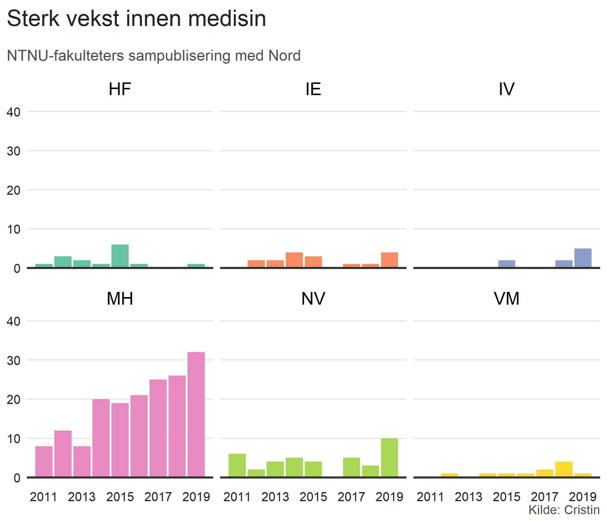
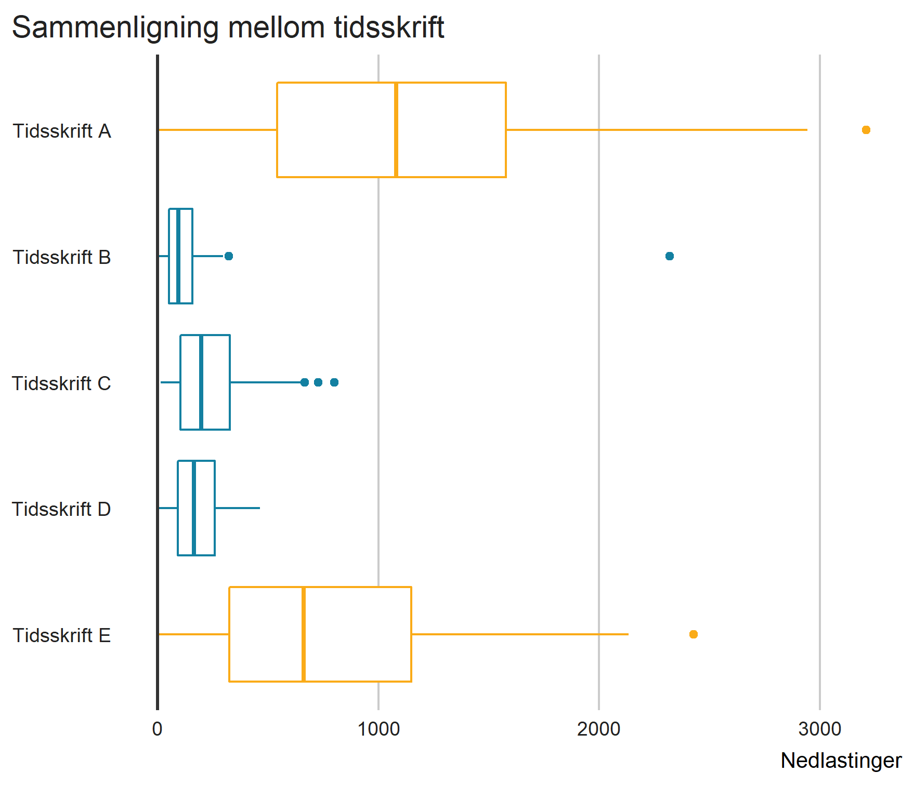
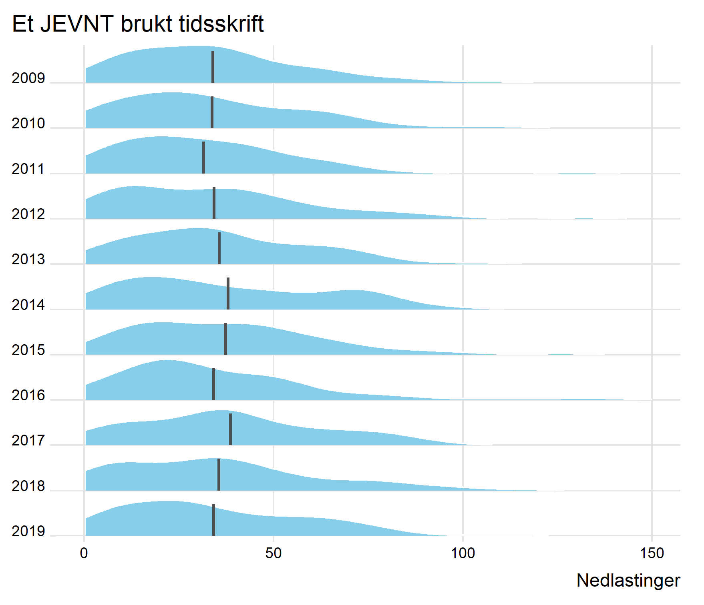
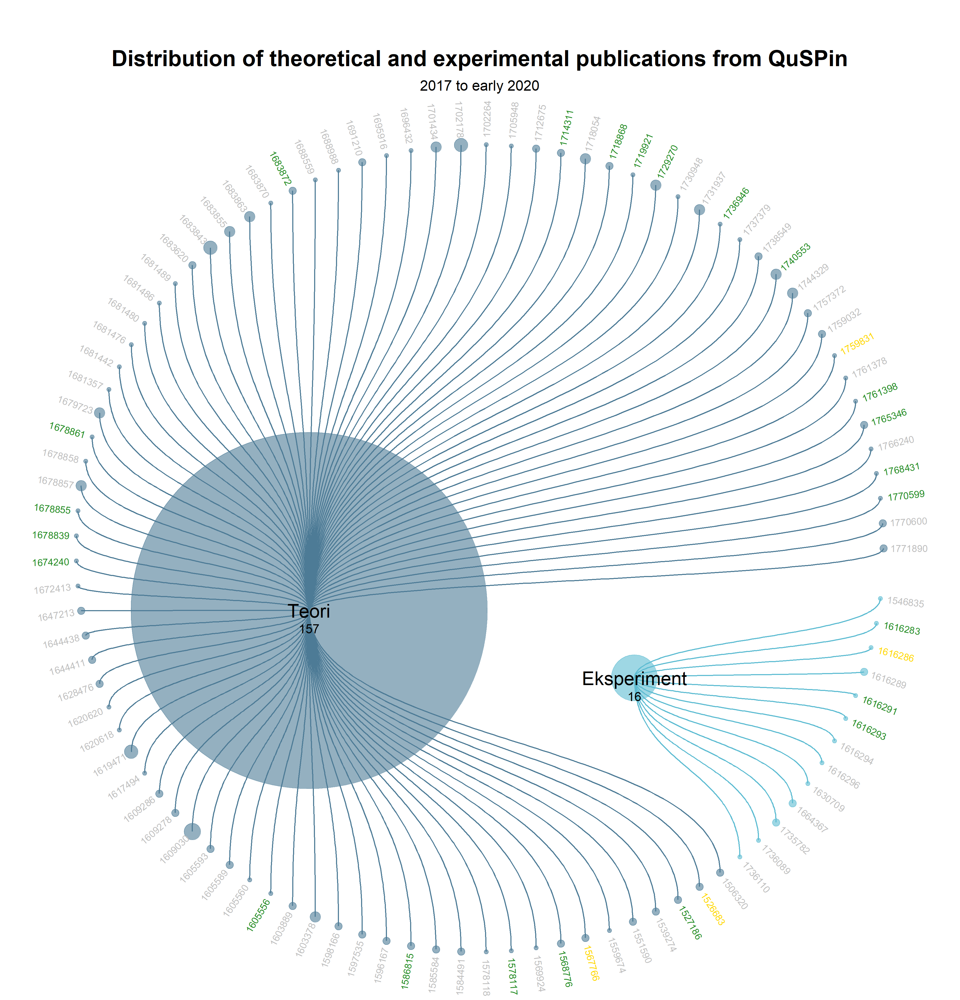

```{r setup, include = FALSE}
knitr::opts_chunk$set(
  echo = FALSE
  )
```

class: center, middle

# The plot thickens

---

# Størrelsesforhold

```{r, out.width = 600, out.height = 500}

```

---

# Oppsummerende statistikk

```{r, out.width = 600, out.height = 500}

```

---

# Distribusjoner

```{r, out.width = 600, out.height = 500}

```

---

```{r, out.width = 600, out.height = 600}

```
